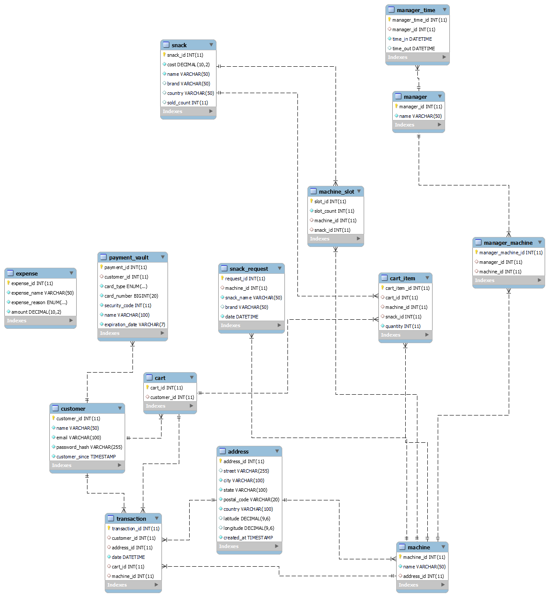

## Customer Table
This table stores information about customers.

| Column Name       | Data Type    | Description                                      |
|-------------------|--------------|--------------------------------------------------|
| customer_id       | INT          | Primary Key, Auto-increment                      |
| name              | VARCHAR(50)  | name of customer                                 |
| email             | VARCHAR(100) | Unique email address                             |
| password_hash     | VARCHAR(255) | Hashed password                                  |
| custmer_since     | TIMESTAMP    | Record creation timestamp                        |

## Address Table
This table stores address information for machines.

| Column Name       | Data Type    | Description                                      |
|-------------------|--------------|--------------------------------------------------|
| address_id        | INT          | Primary Key, Auto-increment                      |
| address           | VARCHAR(255) | Street address                                   |
| city              | VARCHAR(100) | City                                             |
| state             | VARCHAR(100) | State                                            |
| postal_code       | VARCHAR(20)  | Postal code                                      |
| country           | VARCHAR(100) | Country                                          |
| latitude          | DECIMAL(9,6) | Latitude                                         |
| longitude         | DECIMAL(9,6) | Longitude                                        |
| created_at        | TIMESTAMP    | Record creation timestamp                        |

## Snack Table
This table is for snacks. It keeps track of diffrent snacks and how many times a snack has been 
sold.

| Column Name       | Data Type     | Description                                      |
|-------------------|---------------|--------------------------------------------------|
| snack_id          | INT           | Primary Key, Auto-increment                      |
| cost              | DECIMAL(10,2) | Payment amount                                   |
| name              | VARCHAR(50)   | Name of snack                                    |
| brand             | VARCHAR(50)   | Brand of snack                                   |
| country           | VARCHAR(50)   | country of snack                                 |
| sold_count        | INT           | keeps track of how many have been sold           |

## Machine
This table stores the machine information. It keeps track of the number of snacks in the 
machine slots and location data of the machine.
| Column Name       | Data Type    | Description                                      |
|-------------------|--------------|--------------------------------------------------|
| machine_id        | INT          | Primary Key, Auto-increment                      |
| name              | VARCHAR(50)  | Name of machine                                  |
| address_id        | INT          | Foreign Key, references Address                  |


## Machine_Slot Table
This table keeps track of the slot’s of each machine. Not all machines will have the same number of 
slots which is why this table is necessary 


| Column Name       | Data Type    | Description                                      |
|-------------------|--------------|--------------------------------------------------|
| slot_id           | INT          | Primary Key, Auto-increment                      |
| Machine_id        | INT          | Foreign Key, references Cart                     |
| Snack_id          | INT          | Foreign Key, references Snack                    |
| Slot_count        | INT          | The number of snacks in the slot                 |


## Cart Table
Stores The cart and custome that tha cart belongs to 

| Column Name       | Data Type    | Description                                      |
|-------------------|--------------|--------------------------------------------------|
| Cart_id           | INT          | Primary Key, Auto-increment                      |
| customer_id       | INT          | Foreign Key, references Customer                 |

## Cart_item Table
Stores snack infomation so multiple snacks can be in a single cart

| Column Name       | Data Type    | Description                                      |
|-------------------|--------------|--------------------------------------------------|
| Cart_item_id      | INT          | Primary Key, Auto-increment                      |
| Machine_id        | INT          | Foreign Key, references Machine                  |
| Machine_id        | INT          | Foreign Key, references Cart                     |
| Snack_id          | INT          | Foreign Key, references Snack                    |
| Quantity          | INT          | The amount of this particular snack              |


## Transaction Table
This table stores transaction information.
| Column Name       | Data Type    | Description                                      |
|-------------------|--------------|--------------------------------------------------|
| transaction_id    | INT          | Primary Key, Auto-increment                      |
| customer_id       | INT          | Foreign Key, references Customer                 |
| address_id        | INT          | Foreign Key, references Address                  |
| date              | DATETIME     | Event date and time                              |
| cart_id           | INT          | Foreign Key, references Cart                     |
| machine_id        | INT          | Foreign Key, references Machine                  |


## Manger_Time Table
This table stores the clock in and clock out time of the managers
| Column Name       | Data Type    | Description                                      |
|-------------------|--------------|--------------------------------------------------|
| Manger_Time_id    | INT          | Primary Key, Auto-increment                      |
| Manager_id        | INT          | Foreign Key, references Manager                  |
| Time_in           | DATETIME     | Time of clock in                                 |
| Time_out          | DATETIME     | Time of clock out                                |

## Manager Table
Stores The names of machine mangers
| Column Name       | Data Type    | Description                                      |
|-------------------|--------------|--------------------------------------------------|
| Manager_id        | INT          | Primary Key, Auto-increment                      |
| name              | VARCHAR(50)  | Name of manager                                  |

## Manager_machine Table
This ajunction table for machines and managers. A manager can have many machines assigend to them. 
A machine can also have may mangers.

| Column Name       | Data Type    | Description                                      |
|-------------------|--------------|--------------------------------------------------|
| manager_machine_id| INT          | Primary Key, Auto-increment                      |
| Manager_id        | INT          | Foreign Key, references Manager                  |
| Machine_id        | INT          | Foreign Key, references Machine                  |

## Expenses Table
Stores business expenses

| Column Name       | Data Type     | Description                                      |
|-------------------|---------------|--------------------------------------------------|
| expense_id        | INT           | Primary Key, Auto-increment                      |
| expense_name      | VARCHAR(50)   | Name of expense                                  |
| expense_reason    | ENUM          | Expense type (Repair, stock, pay, other)         |
| amount            | DECIMAL(10,2) | Payment amount                                   |

## Payment_vault Table
Stores the payment methods of customers 

| Column Name       | Data Type    | Description                                          |
|-------------------|--------------|------------------------------------------------------|
| payment_id        | INT          | Primary Key, Auto-increment                          |
| customer_id       | INT          | Foreign Key, references Customer                     |
| card_type         | ENUM         | Payment_vault type (Visa, AMEX, Discover, MasterCard)|
| card_number       | BIGINT       | Number on the card                                   |
| security_code     | INT          |  3 or 4 digits on the back of the card               |
| name              | VARCHAR(100) | Name as it appears on the card                       |
| experation_date   | VARCHAR(7)   | expiration date of the card MM/YYYY                  |

## Snack_Request Table
Stores requests made by customers. The requests are requests for sancks that customer would like to be stocked in the machine.

| Column Name       | Data Type    | Description                                      |
|-------------------|--------------|--------------------------------------------------|
| Request_id        | INT          | Primary Key, Auto-increment                      |
| Machine_id        | INT          | Foreign Key, references Machine                  |
| snack_name        | VARCHAR(50)  | Name of the desired snack                        |
| brand             | VARCHAR(50)  | The brand name of the snack                      |
| date              | DATETIME     | Date of the request                              |


# Database Schema




# Test cases

### INSERT customer test

```sql
CREATE DEFINER=`root`@`localhost` PROCEDURE `TestCustomerInsertion`()
BEGIN
    DECLARE testResult VARCHAR(20);
    DECLARE lastId INT;
    
    -- Step 1: Insert the row (without specifying the auto-incremented id)
    INSERT INTO customer (name, email, password_hash) 
    VALUES (
    'TEST CUSTOMER 53272', 
    'customerTEST5864@gmail.com', 
    "password123"
    );
    
    -- Retrieve the last inserted id
    SET lastId = LAST_INSERT_ID();

    -- Step 2: Query the row
    SELECT customer_id, name, email
    INTO @id, @name, @mail
    FROM customer
    WHERE customer_id = lastId;

    -- Step 3: Verify the result
    IF @id = lastId AND @name = 'TEST CUSTOMER 53272' AND @mail = 'customerTEST5864@gmail.com' THEN
        SET testResult = 'Test Passed';
    ELSE
        SET testResult = 'Test Failed';
    END IF;
    
    -- Output the result
    SELECT testResult AS Result;
    
    DELETE FROM customer 
	where email = "customerTEST5864@gmail.com" ;
END
```

### INSERT Snack Test

```sql
CREATE DEFINER=`root`@`localhost` PROCEDURE `TestSnackInsertion`()
BEGIN
    DECLARE testResult VARCHAR(20);
    DECLARE lastId INT;
    
    -- Step 1: Insert the row (without specifying the auto-incremented id)
    INSERT INTO snack (cost, name, brand, country, sold_count) 
    VALUES (
        2.25,
        'TEST snack 53272', 
        'big test brand', 
        'USA',
        8
    );
    
    -- Retrieve the last inserted id
    SET lastId = LAST_INSERT_ID();

    -- Step 2: Query the row
    SELECT snack_id, name
    INTO @id, @name
    FROM snack
    WHERE snack_id = lastId;

    -- Step 3: Verify the result
    IF @id = lastId AND @name = 'TEST snack 53272' THEN
        SET testResult = 'Test Passed';
    ELSE
        SET testResult = 'Test Failed';
    END IF;
    
    -- Output the result
    SELECT testResult AS Result;
    
    -- Clean up the test data
    DELETE FROM snack 
    WHERE snack_id = @id;
END
```
### INSERT Transaction Test

```sql 
CREATE DEFINER=`root`@`localhost` PROCEDURE `TestAddressInsertion`()
BEGIN
    DECLARE testResult VARCHAR(20);
    DECLARE lastId INT;
    
    -- Step 1: Insert the row
    INSERT INTO address (address, city, state, postal_code, country, latitude, longitude, created_at) 
    VALUES (
        '123 Test St', 
        'Test City', 
        'Test State', 
        '12345', 
        'Test Country', 
        45.123456, 
        -93.123456, 
        NOW()
    );
    
    -- Retrieve the last inserted id
    SET lastId = LAST_INSERT_ID();

    -- Step 2: Query the row
    SELECT address_id, address
    INTO @id, @address
    FROM address
    WHERE address_id = lastId;

    -- Step 3: Verify the result
    IF @id = lastId AND @address = '123 Test St' THEN
        SET testResult = 'Test Passed';
    ELSE
        SET testResult = 'Test Failed';
    END IF;
    
    -- Output the result
    SELECT testResult AS Result;
    
    -- Clean up the test data
    DELETE FROM address WHERE address_id = @id;
END

```

### INSERT Address Test

```sql
DELIMITER //

CREATE PROCEDURE TestAddressInsertion()
BEGIN
    DECLARE testResult VARCHAR(20);
    DECLARE lastId INT;
    
    -- Step 1: Insert the row
    INSERT INTO address (address, city, state, postal_code, country, latitude, longitude, created_at) 
    VALUES (
        '123 Test St', 
        'Test City', 
        'Test State', 
        '12345', 
        'Test Country', 
        45.123456, 
        -93.123456, 
        NOW()
    );
    
    -- Retrieve the last inserted id
    SET lastId = LAST_INSERT_ID();

    -- Step 2: Query the row
    SELECT address_id, address
    INTO @id, @address
    FROM address
    WHERE address_id = lastId;

    -- Step 3: Verify the result
    IF @id = lastId AND @address = '123 Test St' THEN
        SET testResult = 'Test Passed';
    ELSE
        SET testResult = 'Test Failed';
    END IF;
    
    -- Output the result
    SELECT testResult AS Result;
    
    -- Clean up the test data
    DELETE FROM address WHERE address_id = @id;
END //

DELIMITER ;

```
### INSERT Machine Test

```sql
DELIMITER //

CREATE PROCEDURE TestMachineInsertion()
BEGIN
    DECLARE testResult VARCHAR(20);
    DECLARE lastId INT;
    
    -- Step 1: Insert the row
    INSERT INTO machine (name, address_id) 
    VALUES ('Test Machine', 1);
    
    -- Retrieve the last inserted id
    SET lastId = LAST_INSERT_ID();

    -- Step 2: Query the row
    SELECT machine_id, name
    INTO @id, @name
    FROM machine
    WHERE machine_id = lastId;

    -- Step 3: Verify the result
    IF @id = lastId AND @name = 'Test Machine' THEN
        SET testResult = 'Test Passed';
    ELSE
        SET testResult = 'Test Failed';
    END IF;
    
    -- Output the result
    SELECT testResult AS Result;
    
    -- Clean up the test data
    DELETE FROM machine WHERE machine_id = @id;
END //

DELIMITER ;

```

### INSERT Machine Slot Test

```sql
DELIMITER //

CREATE PROCEDURE TestMachineSlotInsertion()
BEGIN
    DECLARE testResult VARCHAR(20);
    DECLARE lastId INT;
    
    -- Step 1: Insert the row
    INSERT INTO machine_slot (machine_id, snack_id, slot_count) 
    VALUES (1, 1, 10);
    
    -- Retrieve the last inserted id
    SET lastId = LAST_INSERT_ID();

    -- Step 2: Query the row
    SELECT slot_id, machine_id, snack_id
    INTO @id, @machine_id, @snack_id
    FROM machine_slot
    WHERE slot_id = lastId;

    -- Step 3: Verify the result
    IF @id = lastId AND @machine_id = 1 AND @snack_id = 1 THEN
        SET testResult = 'Test Passed';
    ELSE
        SET testResult = 'Test Failed';
    END IF;
    
    -- Output the result
    SELECT testResult AS Result;
    
    -- Clean up the test data
    DELETE FROM machine_slot WHERE slot_id = @id;
END //

DELIMITER ;


```

### INSERT Cart Test

```sql
DELIMITER //

CREATE PROCEDURE TestCartInsertion()
BEGIN
    DECLARE testResult VARCHAR(20);
    DECLARE lastId INT;
    
    -- Step 1: Insert the row
    INSERT INTO cart (customer_id) 
    VALUES (1);
    
    -- Retrieve the last inserted id
    SET lastId = LAST_INSERT_ID();

    -- Step 2: Query the row
    SELECT cart_id, customer_id
    INTO @id, @customer_id
    FROM cart
    WHERE cart_id = lastId;

    -- Step 3: Verify the result
    IF @id = lastId AND @customer_id = 1 THEN
        SET testResult = 'Test Passed';
    ELSE
        SET testResult = 'Test Failed';
    END IF;
    
    -- Output the result
    SELECT testResult AS Result;
    
    -- Clean up the test data
    DELETE FROM cart WHERE cart_id = @id;
END //

DELIMITER ;


```

### INSERT Cart Item Test

```sql
DELIMITER //

CREATE PROCEDURE TestCartItemInsertion()
BEGIN
    DECLARE testResult VARCHAR(20);
    DECLARE lastId INT;
    
    -- Step 1: Insert the row
    INSERT INTO cart_item (cart_id, machine_id, snack_id, quantity) 
    VALUES (1, 1, 1, 5);
    
    -- Retrieve the last inserted id
    SET lastId = LAST_INSERT_ID();

    -- Step 2: Query the row
    SELECT cart_item_id, cart_id, machine_id, snack_id
    INTO @id, @cart_id, @machine_id, @snack_id
    FROM cart_item
    WHERE cart_item_id = lastId;

    -- Step 3: Verify the result
    IF @id = lastId AND @cart_id = 1 AND @machine_id = 1 AND @snack_id = 1 THEN
        SET testResult = 'Test Passed';
    ELSE
        SET testResult = 'Test Failed';
    END IF;
    
    -- Output the result
    SELECT testResult AS Result;
    
    -- Clean up the test data
    DELETE FROM cart_item WHERE cart_item_id = @id;
END //

DELIMITER ;

```

### INSERT Transaction Test

```sql

DELIMITER //

CREATE PROCEDURE TestTransactionInsertion()
BEGIN
    DECLARE testResult VARCHAR(20);
    DECLARE lastId INT;
    
    -- Step 1: Insert the row
    INSERT INTO transaction (customer_id, address_id, date, cart_id, machine_id) 
    VALUES (1, 1, NOW(), 1, 1);
    
    -- Retrieve the last inserted id
    SET lastId = LAST_INSERT_ID();

    -- Step 2: Query the row
    SELECT transaction_id, customer_id, cart_id
    INTO @id, @customer_id, @cart_id
    FROM transaction
    WHERE transaction_id = lastId;

    -- Step 3: Verify the result
    IF @id = lastId AND @customer_id = 1 AND @cart_id = 1 THEN
        SET testResult = 'Test Passed';
    ELSE
        SET testResult = 'Test Failed';
    END IF;
    
    -- Output the result
    SELECT testResult AS Result;
    
    -- Clean up the test data
    DELETE FROM transaction WHERE transaction_id = @id;
END //

DELIMITER ;
```
### INSERT Manager Time

```sql
DELIMITER //

CREATE PROCEDURE TestManagerTimeInsertion()
BEGIN
    DECLARE testResult VARCHAR(20);
    DECLARE lastId INT;
    
    -- Step 1: Insert the row
    INSERT INTO manager_time (manager_id, time_in, time_out) 
    VALUES (1, NOW(), NOW() + INTERVAL 8 HOUR);
    
    -- Retrieve the last inserted id
    SET lastId = LAST_INSERT_ID();

    -- Step 2: Query the row
    SELECT manager_time_id, manager_id
    INTO @id, @manager_id
    FROM manager_time
    WHERE manager_time_id = lastId;

    -- Step 3: Verify the result
    IF @id = lastId AND @manager_id = 1 THEN
        SET testResult = 'Test Passed';
    ELSE
        SET testResult = 'Test Failed';
    END IF;
    
    -- Output the result
    SELECT testResult AS Result;
    
    -- Clean up the test data
    DELETE FROM manager_time WHERE manager_time_id = @id;
END //

DELIMITER ;

```
### INSERT Manager 
```sql
DELIMITER //

CREATE PROCEDURE TestManagerInsertion()
BEGIN
    DECLARE testResult VARCHAR(20);
    DECLARE lastId INT;
    
    -- Step 1: Insert the row
    INSERT INTO manager (name) 
    VALUES ('Test Manager');
    
    -- Retrieve the last inserted id
    SET lastId = LAST_INSERT_ID();

    -- Step 2: Query the row
    SELECT manager_id, name
    INTO @id, @name
    FROM manager
    WHERE manager_id = lastId;

    -- Step 3: Verify the result
    IF @id = lastId AND @name = 'Test Manager' THEN
        SET testResult = 'Test Passed';
    ELSE
        SET testResult = 'Test Failed';
    END IF;
    
    -- Output the result
    SELECT testResult AS Result;
    
    -- Clean up the test data
    DELETE FROM manager WHERE manager_id = @id;
END //

DELIMITER ;

```
### INSERT Manager Manager Machine
```sql
DELIMITER //

CREATE PROCEDURE TestManagerMachineInsertion()
BEGIN
    DECLARE testResult VARCHAR(20);
    DECLARE lastId INT;
    
    -- Step 1: Insert the row
    INSERT INTO manager_machine (manager_id, machine_id) 
    VALUES (1, 1);
    
    -- Retrieve the last inserted id
    SET lastId = LAST_INSERT_ID();

    -- Step 2: Query the row
    SELECT manager_machine_id, manager_id, machine_id
    INTO @id, @manager_id, @machine_id
    FROM manager_machine
    WHERE manager_machine_id = lastId;

    -- Step 3: Verify the result
    IF @id = lastId AND @manager_id = 1 AND @machine_id = 1 THEN
        SET testResult = 'Test Passed';
    ELSE
        SET testResult = 'Test Failed';
    END IF;
    
    -- Output the result
    SELECT testResult AS Result;
    
    -- Clean up the test data
    DELETE FROM manager_machine WHERE manager_machine_id = @id;
END //

DELIMITER ;

```
### INSERT Expense Test

```sql
DELIMITER //

CREATE PROCEDURE TestExpenseInsertion()
BEGIN
    DECLARE testResult VARCHAR(20);
    DECLARE lastId INT;
    
    -- Step 1: Insert the row
    INSERT INTO expenses (expense_name, expense_reason, amount) 
    VALUES ('Test Expense', 'Repair', 100.00);
    
    -- Retrieve the last inserted id
    SET lastId = LAST_INSERT_ID();

    -- Step 2: Query the row
    SELECT expense_id, expense_name, amount
    INTO @id, @expense_name, @amount
    FROM expenses
    WHERE expense_id = lastId;

    -- Step 3: Verify the result
    IF @id = lastId AND @expense_name = 'Test Expense' AND @amount = 100.00 THEN
        SET testResult = 'Test Passed';
    ELSE
        SET testResult = 'Test Failed';
    END IF;
    
    -- Output the result
    SELECT testResult AS Result;
    
    -- Clean up the test data
    DELETE FROM expenses WHERE expense_id = @id;
END //

DELIMITER ;

```
### INSERT Payment Vault

```sql
DELIMITER //

CREATE PROCEDURE TestPaymentVaultInsertion()
BEGIN
    DECLARE testResult VARCHAR(20);
    DECLARE lastId INT;
    
    -- Step 1: Insert the row
    INSERT INTO payment_vault (customer_id, card_type, card_number, security_code, name, experation_date) 
    VALUES (1, 'Visa', 1234567812345678, 123, 'Test Name', '12/2025');
    
    -- Retrieve the last inserted id
    SET lastId = LAST_INSERT_ID();

    -- Step 2: Query the row
    SELECT payment_id, card_type, name
    INTO @id, @card_type, @name
    FROM payment_vault
    WHERE payment_id = lastId;

    -- Step 3: Verify the result
    IF @id = lastId AND @card_type = 'Visa' AND @name = 'Test Name' THEN
        SET testResult = 'Test Passed';
    ELSE
        SET testResult = 'Test Failed';
    END IF;
    
    -- Output the result
    SELECT testResult AS Result;
    
    -- Clean up the test data
    DELETE FROM payment_vault WHERE payment_id = @id;
END //

DELIMITER ;

```

### INSERT Snack request 

```sql
DELIMITER //

CREATE PROCEDURE TestSnackRequestInsertion()
BEGIN
    DECLARE testResult VARCHAR(20);
    DECLARE lastId INT;
    
    -- Step 1: Insert the row
    INSERT INTO snack_request (machine_id, snack_name, brand, date) 
    VALUES (1, 'Test Snack', 'Test Brand', NOW());
    
    -- Retrieve the last inserted id
    SET lastId = LAST_INSERT_ID();

    -- Step 2: Query the row
    SELECT request_id, snack_name, brand
    INTO @id, @snack_name, @brand
    FROM snack_request
    WHERE request_id = lastId;

    -- Step 3: Verify the result
    IF @id = lastId AND @snack_name = 'Test Snack' AND @brand = 'Test Brand' THEN
        SET testResult = 'Test Passed';
    ELSE
        SET testResult = 'Test Failed';
    END IF;
    
    -- Output the result
    SELECT testResult AS Result;
    
    -- Clean up the test data
    DELETE FROM snack_request WHERE request_id = @id;
END //

DELIMITER ;

```